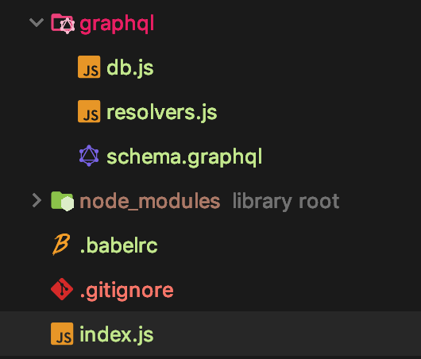

# GraphQL practice

This document refers to [this course](https://www.inflearn.com/course/graphql#description).

Why using GraphQL?
---

1. Over fetching
   - Front-End 에서 DB 에 요청할 때 필요없는 데이터를 배제한다.
  
2. Under fetching
   - 앱이 뜰때 유저데이터, 피드, 공지 등 여러번의 조회가 일어날 수 있다. 이것이 Under fetching.
   - GraphQL 이 이러한 요청들을 묶어서 한번만에 해결할 수 있다.
  
기존의 REST 와는 차이가있다. 하나의 쿼리로 모든걸 해결한다.

```javascript
query {
  feed  {
    comments
    likeNumber
  }
  notifications {
    isRead
  }
  user {
    username
    profilePic
  }
}
``` 
이렇게 하나의 쿼리로 해당 오브젝트의 데이터를 디비에서 가져온다.
(참고로 JSON 이 아닌 JavaScript 이다!)

Simple Flow
---


**1. GraphQLServer start**
```javascript
import { GraphQLServer } from 'graphql-yoga';
import resolvers from './graphql/resolvers';

const server = new GraphQLServer({
    typeDefs: "graphql/schema.graphql",
    resolvers
});
server.start(() => console.log('GraphQL is running...'));
```

- typeDefs 는 요청할 데이터의 형태(타입)가 모여있는 곳이다.
- resolvers 는 Mutations, 데이터의 가공이 일어나는 곳이다.

<br/>

**2. Set TypeDefs**
```javascript
type Persion {
    id: Int!
    name: String!
    age: Int!
    gender: String!
}

type Query {
    people: [Persion]!
    person(id: Int!): Persion
}
```
- Query 에 요청할 녀석들을 적는다.
- people 을 요청할 경우 Person 객체 배열이 떨어지고 person(id) 를 하면 id 의 Person 객체가 떨어진다.

<br/>

**3. Set Resolvers**
```javascript
import {getById, people} from './db';

const resolvers = {
    Query: {
        people: () => people,
        // 첫 번째 인자 _ 는 현재 오브젝트를 의미. 이후 더 자세히 설명
        person: (_, { id }) => getById(id)
    }
};
export default resolvers;
``` 
- Query 에서 타입을 지정했다면 Resolvers 에서는 실제 로직의 형태를 정의한다.

<br/>

**4. Set Data** 
```javascript
export const people = [
    {
        id: '0',
        name: 'Nicolas',
        age: 18,
        gender: 'female'
    },
    {
        id: '1',
        name: '1ilsang',
        age: 27,
        gender: 'male'
    }
];

export const getById = (id) => {
    const filteredPeople = people.filter(person => String(id) === person.id);
    return filteredPeople[0];
};
```
- db.js 에서 데이터와 실제 함수를 만든다.
- 이 부분은 나중에 API 요청이나 Service 등으로 빼야할듯?

<br/>

**5. Results**
```javascript
query {
  person (id: 1) {
    name
  }
}
/////// RESULT /////////
{
  "data": {
    "person": {
      "name": "1ilsang"
    }
  }
}
```
- person(1) 에 해당하는 1ilsang 데이터를 가져오는 모습.

